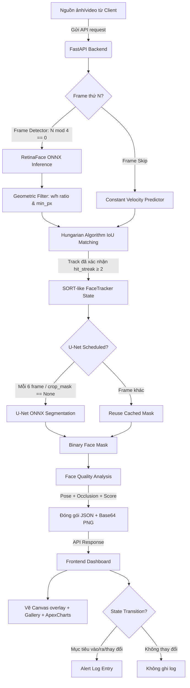

# AI Crowd Face Surveillance Console (Hệ Thống Giám Sát Khuôn Mặt AI)

Dự án này là một hệ thống Giám sát Khuôn mặt Đám đông thông minh (AI CCTV Console) được phát triển phục vụ cho các kịch bản an ninh công cộng. Ứng dụng thực hiện đồng thời hai bài toán thị giác máy tính cốt lõi: **Phát hiện và Theo dõi khuôn mặt đám đông (Face Detection + Tracking)** và **Phân vùng khuôn mặt (Face Segmentation)** sử dụng các công nghệ trí tuệ nhân tạo tiên tiến.

---

## Các Tính Năng Nổi Bật

1. **Nhận diện khuôn mặt đám đông (RetinaFace ONNX):** Định vị chính xác tọa độ bounding box và 5 điểm landmarks (mắt, mũi, miệng) của nhiều đối tượng trong cảnh đông người. Hỗ trợ hai backbone: **MobileNet0.25** (ưu tiên tốc độ, ~24ms) và **ResNet50** (ưu tiên độ chính xác).

2. **Theo dõi mục tiêu đa đối tượng (SORT-like Tracker):** Duy trì ID ổn định cho từng khuôn mặt qua nhiều khung hình liên tiếp sử dụng thuật toán Hungarian Algorithm + IoU Cost Matrix và Constant Velocity Predictor. Bao gồm:
   - **Bộ lọc hình học (Geometric Filter):** Tự động loại bỏ false positive (lỗ thông gió, bảng hiệu, hoa văn) có kích thước < 36px hoặc tỉ lệ w/h bất thường.
   - **Hit-streak gate:** Track chỉ được xác nhận sau N ≥ 2 lần phát hiện liên tiếp, ngăn chặn box flash từ background.
   - **Velocity-predicted IoU:** Dự báo vị trí mục tiêu dựa trên vận tốc dịch chuyển trước khi so khớp, đảm bảo ID không bị swap khi người di chuyển nhanh hoặc đi qua nhau.

3. **Phân vùng chi tiết vùng mặt (U-Net ONNX):** Tạo lớp phủ mặt nạ phân vùng (Face Mask) sắc nét bao quanh khuôn mặt. U-Net chỉ chạy mỗi N frame (throttled) để tối ưu hiệu năng, các frame trung gian dùng cached mask.

4. **Đánh giá chất lượng khuôn mặt (Face Quality Analytics):** Tự động tính toán độ che khuất (Occlusion) và ước lượng hướng quay đầu (Head Pose: Trái, Phải, Ngửa, Cúi, Thẳng) dựa trên hình học landmarks và tỉ lệ mặt nạ.

5. **Giao diện Modern Glassmorphism Dashboard:** Thiết kế giao diện mô phỏng phòng điều khiển an ninh cao cấp với hiệu ứng mờ kính cường lực, viền neon phát sáng và hiệu ứng quét camera.

6. **Biểu đồ thống kê thời gian thực (ApexCharts.js):**
   - Biểu đồ tròn hiển thị tỉ lệ phân bổ chất lượng (Excellent, Good, Acceptable, Poor, Unusable).
   - Biểu đồ cột ngang hiển thị phân tích góc quay đầu (Head Pose).
   - Biểu đồ đường vẽ lịch sử biến động số lượng mục tiêu trong khung nhìn.

7. **Nhật ký cảnh báo theo sự kiện (State-Transition Alerting):** Ghi log cảnh báo chỉ khi có **thay đổi trạng thái** mới (mục tiêu vào/ra, thay đổi chất lượng, thay đổi mật độ đám đông), không spam lặp lại theo từng giây.

8. **Gallery mục tiêu lưu trữ phiên (Session Face Gallery):** Lưu trữ và hiển thị tất cả khuôn mặt đã từng xuất hiện trong phiên giám sát hiện tại. Khuôn mặt đã rời khỏi camera được đánh dấu **OFFLINE** (mờ xám) thay vì xóa đi.

9. **Lưu trữ bằng chứng (Evidence Snapshot):** Hỗ trợ chụp và tải xuống hồ sơ bằng chứng đầy đủ cho từng đối tượng (gồm ảnh toàn cảnh, ảnh chân dung cắt nền trong suốt chứa kênh alpha mặt nạ, mặt nạ nhị phân và file thông số JSON).

---

## Cấu Trúc Mã Nguồn

Dự án được thiết kế theo cấu trúc Modular sạch sẽ, phân tách rõ ràng giữa Backend (FastAPI phục vụ logic AI) và Frontend (giao diện điều khiển tĩnh):

```text
/ (Thư mục gốc)
├── backend/
│   ├── main.py               # Máy chủ FastAPI chính & các API Endpoints
│   ├── app_logging/          # Hệ thống ghi log có cấu trúc
│   │   └── structured_logger.py  # Logger ghi JSON có timestamp & event type
│   ├── data/                 # Chứa cấu hình và nạp dữ liệu RetinaFace
│   │   └── config.py         # Cấu hình kiến trúc mạng RetinaFace (MNet, ResNet)
│   ├── models/               # Bộ điều khiển (Wrappers) suy luận mô hình
│   │   ├── face_detector.py  # Wrapper chạy RetinaFace ONNX & Hậu xử lý hình học
│   │   └── face_segmenter.py # Wrapper chạy U-Net ONNX & Tiền xử lý
│   ├── quality/              # Đánh giá chất lượng khuôn mặt
│   │   ├── alert.py          # Logic hỗ trợ gửi cảnh báo
│   │   ├── face_quality.py   # Phân tích Occlusion và Head Pose hình học
│   │   └── logger.py         # Trích xuất lịch sử hoạt động hệ thống
│   ├── segmentation/         # Mã nguồn gốc PyTorch U-Net (huấn luyện/cấu hình)
│   │   ├── config.py         # Cấu hình các lớp phân vùng da mặt & ngũ quan
│   │   ├── model.py          # Định nghĩa kiến trúc mạng PyTorch U-Net
│   │   └── postprocess.py    # Chuyển đổi Logits sang nhãn mặt nạ nhị phân
│   ├── utils/
│   │   └── tracker.py        # **SORT-like Tracker** – Hungarian IoU matching,
│   │                         #   geometric filter, velocity predictor, hit-streak gate
│   └── weights/              # Nơi lưu trữ file trọng số (.pth và .onnx)
│
├── frontend/                 # Giao diện an ninh tĩnh được serve bởi FastAPI
│   ├── index.html            # Giao diện Web Dashboard (Glassmorphism layout)
│   ├── css/
│   │   └── style.css         # CSS định kiểu giao diện hiện đại & Neon HUD
│   └── js/
│       └── app.js            # Logic webcam loop, Session Gallery, State-Transition
│                             #   Alert Logger, biểu đồ ApexCharts & âm thanh HUD
│
├── tests/
│   ├── benchmark/            # Kiểm thử hiệu năng (Latency, FPS)
│   ├── integration/          # Kiểm thử API endpoint /detect
│   ├── model/                # Kiểm thử mô hình detector và segmenter
│   └── unit/                 # Kiểm thử đơn vị face_quality
│
├── docs/                     # Tài liệu dự án đầy đủ
├── export_onnx.py            # Script xuất các mô hình .pth sang mô hình tăng tốc .onnx
├── requirements.txt          # Khai báo các thư viện Python phụ thuộc
└── run.py                    # Script chạy nhanh hệ thống (kích hoạt backend/main.py)
```

---

## Luồng Xử Lý Logic & Trí Tuệ Nhân Tạo

Sơ đồ dưới đây mô tả toàn bộ pipeline AI từ khi nhận frame camera đến khi kết quả được hiển thị trên giao diện giám sát:



Các bước xử lý cụ thể bao gồm:

1. **Skip-frame Detection:** Detector nặng (RetinaFace) chỉ chạy mỗi 4 frame. 3 frame trung gian dùng Constant Velocity Predictor để cập nhật vị trí bbox theo hướng vận tốc đã tính.
2. **Bộ lọc hình học (Geometric Filter):** Mỗi detection từ RetinaFace được kiểm tra tỉ lệ `w/h` (phải từ 0.4–2.5) và kích thước tối thiểu (mặc định 36px, người dùng có thể chỉnh). Detection không hợp lệ bị loại bỏ ngay lập tức để tránh false positive trên background.
3. **Hungarian Algorithm Matching:** Ma trận IoU giữa detection hiện tại và vị trí dự báo của các track được tính toán. Thuật toán Hungarian (scipy.optimize.linear_sum_assignment) tìm phân công tối ưu toàn cục, đảm bảo không bị ID swap dù nhiều người đi gần nhau.
4. **Hit-streak Gate:** Track mới (tentative) chỉ được chuyển sang confirmed sau khi được ghép thành công ≥ 2 lần liên tiếp. Điều này ngăn box flash từ false positive.
5. **Phân vùng khuôn mặt (U-Net):** Từng khuôn mặt được crop và đưa qua U-Net ONNX mỗi 6 frame/track. Mask được cache và resize cho các frame trung gian.
6. **Đánh giá chất lượng (Telemetry):** Tính toán Occlusion và Head Pose dựa trên mask và landmarks.
7. **State-Transition Alert Logger:** Frontend chỉ ghi cảnh báo khi có thay đổi trạng thái thực sự (mục tiêu mới, mục tiêu rời đi, thay đổi mật độ đám đông, thay đổi chất lượng).

---

## 🛠️ Hướng Dẫn Cài Đặt & Chạy Dự Án (Local)

### 1. Yêu cầu hệ thống
* Python 3.8 – 3.12 đã được cài đặt.
* Webcam kết nối với máy tính (tùy chọn, cần cho tính năng live stream).
* Thư viện `scipy` (được cài tự động qua `requirements.txt`).

### 2. Cài đặt các thư viện phụ thuộc
```bash
pip install -r requirements.txt
```

> **Ghi chú**: Quá trình suy luận (Inference) đã được tăng tốc bằng ONNX Runtime (nhanh hơn 2–3× so với PyTorch thuần). PyTorch vẫn giữ trong requirements để phục vụ giải mã hình học legacy và các công cụ export mô hình.

### 3. Chuẩn bị Mô hình (Weights)

Dự án cần 3 file mô hình ONNX trong thư mục `backend/weights/`:
- `mobilenet0.25_Final.onnx`
- `Resnet50_Final.onnx`
- `unet_face_celeb.onnx`

**Cách 1: Tải tự động (Khuyên dùng)**
Khi chạy `python run.py`, hệ thống tự động kiểm tra và tải về từ GitHub Releases nếu thiếu.

**Cách 2: Chuyển đổi thủ công (nếu đã có `.pth`)**
```bash
python export_onnx.py
```

> [!IMPORTANT]
> **Dành cho Quản trị viên Repo:** Để tính năng tải tự động hoạt động, cần tạo Release trên GitHub với tag `v1.0.0` và đính kèm 3 file ONNX vào phần Assets.

### 4. Khởi chạy Server
```bash
python run.py
```
Hệ thống sẽ khởi động tại `http://0.0.0.0:5000`. Truy cập giao diện tại:

👉 **`http://127.0.0.1:5000`**

---

## 📖 Hướng Dẫn Sử Dụng Giao Diện

1. **Chọn nguồn dữ liệu:** Tại bảng điều khiển bên phải, chọn nguồn camera tương ứng (ảnh tĩnh, file video MP4/AVI, hoặc Webcam USB trực tiếp).
2. **Cấu hình hiển thị:** Bật/tắt các checkbox HUD (Bounding Box, Landmarks, Mặt nạ U-Net, Target ID, Điểm tin cậy, Chất lượng, Âm thanh).
3. **Ngưỡng tin cậy:** Kéo thanh trượt **"Ngưỡng tin cậy tối thiểu"** (mặc định **0.60**) để lọc các phát hiện có confidence thấp.
4. **Kích thước mặt tối thiểu:** Kéo thanh trượt **"Kích thước mặt tối thiểu (px)"** (mặc định **36px**, range 20–200px) để kiểm soát ngưỡng bộ lọc hình học. Tăng giá trị này để giảm false positive trên bảng hiệu hoặc các vật thể nhỏ.
5. **Chọn mô hình AI:** Chuyển đổi giữa backbone **MobileNet** (nhanh, ưu tiên live stream) và **ResNet50** (chính xác hơn cho đám đông dày đặc).
6. **Gallery mục tiêu:** Panel "Mục tiêu phát hiện" hiển thị tất cả khuôn mặt trong phiên. Khuôn mặt đã rời camera hiển thị badge xám **OFFLINE**. Nhấn "🗑️ Dọn dẹp nhật ký" để xóa toàn bộ lịch sử và bắt đầu phiên mới.
7. **Chụp Evidence:** Click nút "Chụp evidence" để tải về hồ sơ bằng chứng đầy đủ của phiên (ảnh toàn cảnh + crop PNG trong suốt + file JSON thông số).

---

## ⚙️ Biến Môi Trường & Cấu Hình

| Biến | Mặc định | Mô tả |
|---|---|---|
| `DETECTOR_INTERVAL` | `4` | Chạy RetinaFace mỗi N frame. Giảm xuống `2` nếu muốn chính xác hơn (đổi lấy FPS thấp hơn). |
| `ONNX_INTRA_OP_THREADS` | `0` (auto) | Số luồng CPU cho ONNX Runtime inference. |

Đặt trong file `.env` hoặc `export DETECTOR_INTERVAL=2` trước khi chạy server.

---

## 🧪 Chạy Kiểm Thử

```bash
pytest
```

Bộ test hiện tại gồm **21 test cases** bao gồm:
- Benchmark hiệu năng (latency & FPS)
- Integration test API `/detect`
- Model test (detector và segmenter)
- Unit test `face_quality` (occlusion, pose, score)

---

## Phụ Thuộc Chính

| Thư viện | Mục đích |
|---|---|
| `fastapi` + `uvicorn` | Web framework & ASGI server |
| `onnxruntime` | Chạy RetinaFace & U-Net ONNX (CPU tăng tốc) |
| `opencv-python` | Xử lý ảnh, vẽ annotations |
| `torch` + `torchvision` | Giải mã hình học legacy, export ONNX |
| `scipy` | Hungarian Algorithm (linear_sum_assignment) cho SORT tracker |
| `numpy` | Xử lý ma trận & mặt nạ nhị phân |
| `pillow` | Encode/decode ảnh trong testing |
